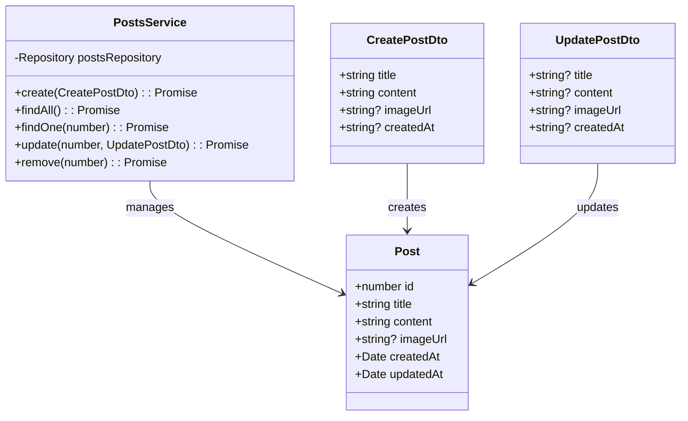
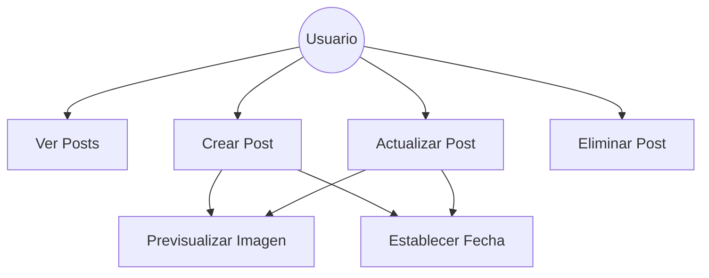
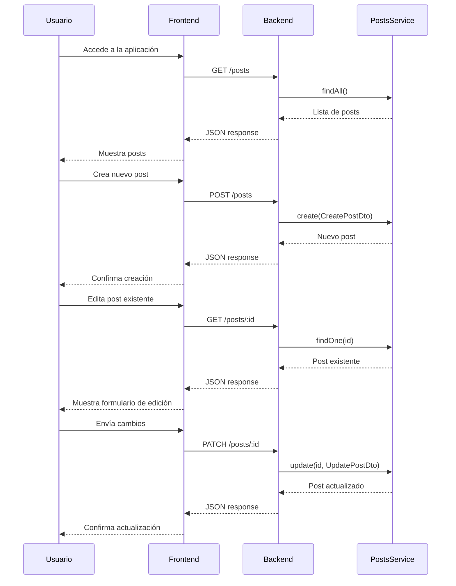
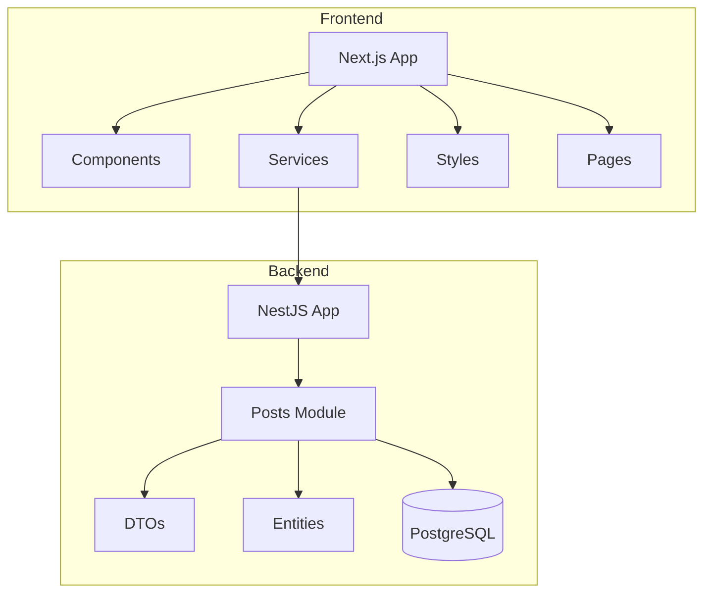

# 🏗 Arquitectura del Proyecto - Blog Project

## Diagramas UML

### 1. Diagrama de Clases 📊



### 2. Diagrama de Casos de Uso 👥



### 3. Diagrama de Secuencia 🔄



### 4. Diagrama de Paquetes 📦



## Modelo Relacional (MR) 💾

La aplicación utiliza PostgreSQL como base de datos, con la siguiente estructura:

```sql
CREATE TABLE posts (
    id          SERIAL PRIMARY KEY,
    title       VARCHAR(255) NOT NULL,
    content     TEXT NOT NULL,
    image_url   VARCHAR(512),
    created_at  TIMESTAMP DEFAULT CURRENT_TIMESTAMP,
    updated_at  TIMESTAMP DEFAULT CURRENT_TIMESTAMP
);
```

### Notas sobre el Modelo Relacional:
- `id`: Identificador único autoincremental
- `title`: Título del post, obligatorio
- `content`: Contenido del post, obligatorio
- `image_url`: URL de la imagen, opcional
- `created_at`: Fecha de creación con valor por defecto
- `updated_at`: Fecha de última actualización

## Notas Técnicas 📝

### Frontend (Next.js)
- Framework React con SSR
- Componentes modulares
- Gestión de estado local con React Hooks
- Servicios API centralizados
- Estilos CSS modernos
- Manejo de rutas dinámicas
- Validación de formularios
- Vista previa de imágenes
- Gestión de fechas personalizadas

### Backend (NestJS)
- Arquitectura modular
- Servicios RESTful
- DTOs para validación
- Entidades TypeORM
- Manejo de errores centralizado
- Conexión a PostgreSQL
- Migraciones automáticas
- Validación de datos

### Comunicación
- API REST
- JSON como formato de datos
- Validación en ambos extremos
- Manejo de errores robusto
- CORS configurado
- Endpoints seguros

### Base de Datos
- PostgreSQL 17.2
- TypeORM para ORM
- Migraciones automáticas
- Índices optimizados
- Relaciones definidas
- Timestamps automáticos